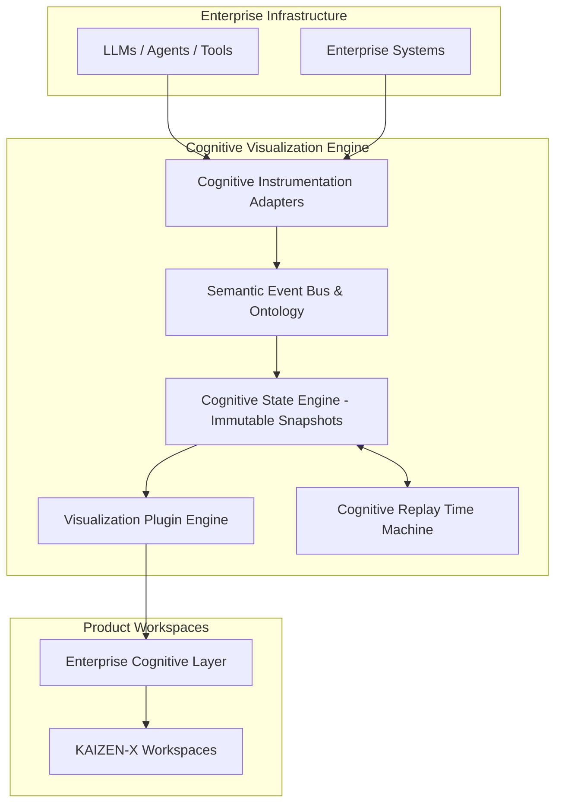

<div align="center">
  
  <h1>KAIZEN-X V4.0</h1>
  <p><strong>Powered by the Cognitive Visualization Engine (CVE)</strong></p>
  
  <p>
    
    
    
    
    
  </p>

  <p>
    <a href="#overview">Overview</a> •
    <a href="#core-architecture">Architecture</a> •
    <a href="#cognitive-visualization-engine">CVE</a> •
    <a href="#quick-start">Quick Start</a>
  </p>
</div>

<br/>

## 🌐 Overview

**KAIZEN-X** has evolved from an enterprise dashboard into a living **Enterprise Cognitive Operating System**. It predicts operational failures, visualizes enterprise risk blast radiuses through dynamic graphing, simulates future outcomes via Monte Carlo simulations, and orchestrates localized Multi-Agent Swarms to execute recovery actions.

Most importantly, KAIZEN-X is built on top of the **Cognitive Visualization Engine (CVE)**—a product-agnostic platform designed to render the real-time cognition of AI systems.

---

## 🧠 The Cognitive Visualization Engine (CVE)

CVE is a universal platform that answers one question continuously: *"What is the enterprise intelligence understanding right now?"*

It enforces absolute scientific honesty: **Every animation corresponds to an observed backend event, a measurable computation, or an explicitly inferred cognitive state. No fabricated reasoning.**

### Key Features of CVE
- **Formal Cognitive Ontology**: All AI events are mapped to a strict taxonomy (Observation, Memory, Attention, Reasoning, Evidence, Decision, Execution, Learning).
- **Immutable Event-Sourced State**: The Cognitive State Engine processes events into immutable state snapshots (like Git), enabling a fully queryable world model of intelligence.
- **Cognitive Time Machine**: Every session can be recorded and scrubbed through via a timeline slider. You can literally rewind the intelligence to see exactly when and why a decision changed.
- **Cognitive Inspector**: "DevTools for Intelligence." Click any hypothesis to see its creator, evidence, confidence history, and alternative futures.
- **Universal Plugin API**: The visualization layer is entirely decoupled. Plugins (like the Cognitive Timeline or Attention Heatmap) independently subscribe to state snapshots.

---

## 🏗 Core Architecture



---

## ⚡ Modules & Workspaces

- **Mission Control**: Enterprise Brain, Working Memory, and Attention Allocation.
- **Enterprise Digital Twin**: Graph propagation, event wavefronts, and causal evolution.
- **Future Observatory**: Alternative futures, branching scenarios, and Monte Carlo engines.
- **Agent War Room**: Multi-Agent debate, Evidence flow, and Hypothesis generation.
- **Decision Studio**: Decision Gravity tracking and Confidence Terrain topology.
- **Boardroom**: Token Birth (executive summaries emerging dynamically from evidence) and Learning visualization.

---

## 🚀 Quick Start

### Prerequisites
- [Docker](https://www.docker.com/) & Docker Compose
- [Node.js 20+](https://nodejs.org/) (For local frontend dev)
- [Python 3.11+](https://www.python.org/) (For local backend dev)
- [Ollama](https://ollama.ai/) (Required for local Agent Swarm inference)

### 1. Start via Docker (Recommended)

```bash
git clone https://github.com/Daksh-Aneja-Projects/KAIZEN-X.git
cd KAIZEN-X
docker compose up --build
```
*The UI will be available at `http://localhost:3000` and the API at `http://localhost:8000`.*

### 2. Local Development Setup

**Backend:**
```bash
cd backend
python -m venv venv
source venv/bin/activate  # On Windows: venv\Scripts\activate
pip install -r requirements.txt
uvicorn app.main:app --reload --port 8000
```

**Frontend:**
```bash
cd frontend
npm install
npm run dev
```

---

## 📜 Non-Goals (Philosophical Constraints)
To preserve the integrity of CVE:
- CVE does **not** claim to reveal or reconstruct private model chain-of-thought.
- CVE does **not** fabricate reasoning steps to make visualizations appear richer.
- CVE does **not** couple visualizations to any specific model provider.
- CVE treats inferred cognitive states as distinct from observed events and labels them accordingly.

---

<div align="center">
  <b>Built with precision for the modern enterprise.</b>
</div>
