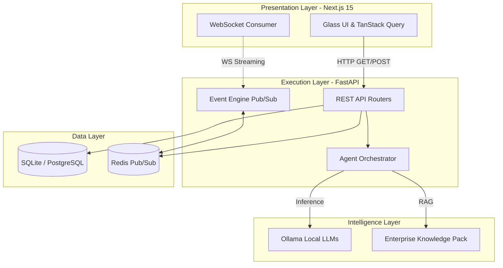

<div align="center">
  
  <h1>KAIZEN-X</h1>
  <p><strong>The Autonomous Enterprise Operating System</strong></p>
  
  <p>
    
    
    
    
    
  </p>

  <p>
    <a href="#overview">Overview</a> •
    <a href="#core-architecture">Architecture</a> •
    <a href="#features--modules">Modules</a> •
    <a href="#quick-start">Quick Start</a> •
    <a href="#documentation">Docs</a>
  </p>
</div>

<br/>

## 🌐 Overview

**KAIZEN-X** is not a dashboard. It is an **Autonomous Enterprise Operating System** designed for extreme information density, Palantir-style data visualization, and localized AI intelligence. 

It predicts operational failures, visualizes enterprise risk blast radiuses through dynamic graphing, simulates future outcomes via Monte Carlo simulations, and orchestrates localized Multi-Agent Swarms to execute recovery actions.

### 💡 Why KAIZEN-X?
Modern enterprises generate more telemetry than humans can parse. KAIZEN-X bridges the gap between raw data and executive execution by embedding an autonomous **Swarm Intelligence Engine** directly into the data layer. 

---

## ⚡ Features & Modules

- **Executive Command Center:** Glass-morphism, high-density telemetry streaming from WebSocket endpoints.
- **Enterprise Digital Twin:** Neo4j-inspired dynamic blast-radius mapping. See how a vendor failure ripples into project delays and revenue loss.
- **Future Observatory & Outcome Explorer:** Simulates `10,000` futures using localized execution. Clusters outcomes into Probable, Optimal, and Catastrophic bands.
- **Agent War Room:** A 5-panel Multi-Agent Swarm Intelligence feed. Watch Risk, Finance, Ops, Strategy, and Executive agents debate and converge on solutions in real-time.
- **Decision Studio:** Dense matrix evaluation of potential recovery paths.
- **Autonomous Recovery Center:** Interactive DAG (Directed Acyclic Graph) orchestration for recovery pipelines with human-in-the-loop validation.

---

## 🏗 Core Architecture

The platform operates on a decoupled architecture optimized for real-time streaming and local LLM execution.



---

## 🚀 Quick Start

### Prerequisites
- [Docker](https://www.docker.com/) & Docker Compose
- [Node.js 20+](https://nodejs.org/) (For local frontend dev)
- [Python 3.11+](https://www.python.org/) (For local backend dev)
- [Ollama](https://ollama.ai/) (Required for local Agent Swarm inference)

### 1. Start via Docker (Recommended)

The easiest way to spin up the entire KAIZEN-X cluster is through Docker Compose.

```bash
# Clone the repository
git clone https://github.com/Daksh-Aneja-Projects/KAIZEN-X.git
cd KAIZEN-X

# Build and start the cluster
docker compose up --build
```
*The UI will be available at `http://localhost:3000` and the API at `http://localhost:8000`.*

### 2. Local Development Setup

If you wish to run the services bare-metal:

**Backend:**
```bash
cd backend
python -m venv venv
source venv/bin/activate  # On Windows: venv\Scripts\activate
pip install -r requirements.txt
uvicorn app.main:app --reload --port 8000
```

**Frontend:**
```bash
cd frontend
npm install
npm run dev
```

---

## 🧠 Multi-Agent Swarm Configuration

KAIZEN-X uses localized inference to guarantee data privacy. By default, it looks for an Ollama instance at `http://localhost:11434`.

Ensure you have pulled a base model before triggering the War Room:
```bash
ollama run llama3
# OR
ollama run mistral
```
Update the `.env` in the backend if your Ollama instance is hosted elsewhere.

---

## 📂 Project Structure

```text
KAIZEN-X/
├── backend/                  # FastAPI Application
│   ├── app/
│   │   ├── routers/          # API Endpoints (war-room, twin, futures)
│   │   ├── services/         # Core Business Logic & Orchestrators
│   │   ├── llm/              # Ollama Integration & Prompts
│   │   ├── models.py         # SQLAlchemy Data Models
│   │   └── main.py           # Application Entrypoint
│   └── requirements.txt      # Python Dependencies
├── frontend/                 # Next.js 15 Application
│   ├── src/
│   │   ├── app/              # Page Routes (war-room, twin, recovery-center, etc.)
│   │   ├── components/       # Reusable UI Components
│   │   └── lib/              # Utils and API config
│   ├── public/               # Static Assets
│   └── tailwind.config.ts    # Palantir-style Design System Tokens
└── docker-compose.yml        # Orchestration Config
```

---

## 🛡️ License

This project is licensed under the MIT License - see the [LICENSE](LICENSE) file for details.

---

<div align="center">
  <b>Built with precision for the modern enterprise.</b>
</div>
